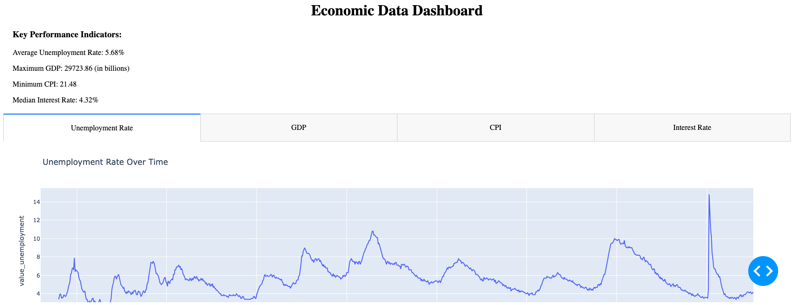
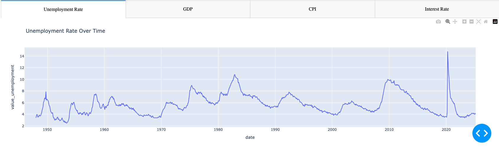
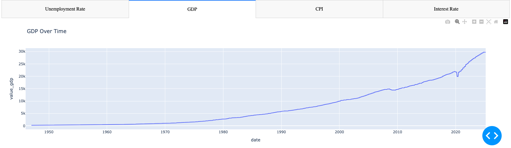
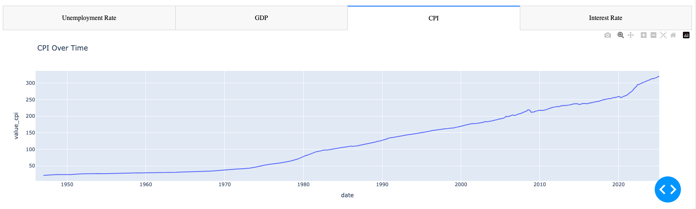
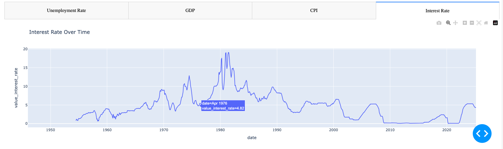

# 📊 Economic Data Dashboard (FRED API + Dash)

An interactive dashboard built with **Dash and Plotly** that visualizes key US economic indicators like **Unemployment Rate**, **GDP**, **Consumer Price Index (CPI)**, and **Interest Rates**. This project pulls real-time data from the **FRED (Federal Reserve Economic Data)** API and presents trends and key performance indicators (KPIs) in a user-friendly web interface.

---

## 🧠 Project Objectives

- Fetch real-time economic data from the **FRED API**
- Clean, merge, and analyze multiple economic indicators
- Visualize trends using interactive line charts (Plotly)
- Display **Key Performance Indicators (KPIs)** such as:
  - Average Unemployment Rate
  - Maximum GDP
  - Minimum CPI
  - Median Interest Rate
- Deploy a **web dashboard using Dash** with multiple tabs

---

## 🛠️ Tech Stack

- **Python**
- **Dash** (for web app development)
- **Plotly Express** (for visualizations)
- **Pandas** (for data manipulation)
- **FRED API** (economic data source)
- **HTML/CSS via Dash Components**

---

## 📷 Dashboard Preview

### 🧠 Full Dashboard Overview

### 📉 Unemployment Rate Over Time

### 💰 GDP Over Time

### 📊 CPI Over Time

### 💹 Interest Rate Over Time

## ✅ Conclusion

📉 Unemployment Rate
The unemployment rate shows cyclical spikes during recessions (notably in the early 1980s, 2008–09, and a sharp peak in 2020 due to COVID-19).

Long-term trend shows a general decline with temporary shocks, reflecting the economy’s recovery capacity.

💰 GDP Over Time
A consistent upward trend in GDP indicates long-term economic growth.

Minor dips correspond to global economic downturns (2008–09, COVID-19).

The dataset reflects increasing productivity and scale of the U.S. economy, reaching over $29,000 billion in recent years.

📊 Consumer Price Index (CPI)
The CPI has steadily increased, highlighting consistent inflation over decades.

Notable acceleration in CPI post-2020 suggests a period of rising inflation, likely due to supply chain constraints and economic stimulus.

💹 Interest Rate
Interest rates have fluctuated significantly, peaking near 20% in the 1980s to combat inflation.

A prolonged low-interest period followed the 2008 crisis and COVID-19.

Recent hikes reflect attempts to curb inflation again post-pandemic.

Summary Insight:
The dashboard highlights how economic shocks, inflation control policies, and recovery cycles are interlinked. Analysts and policymakers can use this tool to visualize and interpret long-term trends that influence economic stability.
